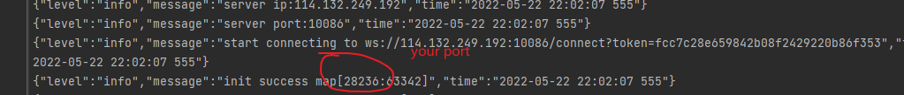

# burst

Intranet to public network.

[write intranet penetration from 0 to 1](https://github.com/fzdwx/burst/issues/6)

## Introduction
基本原理:
1. 客户端与服务端建立`websocket`连接(为什么是ws? 因为我刚好最近在弄这个，其他的也可以，比如说直接一个裸的tcp)，然后告诉服务端自己要暴露到公网的端口。
2. 服务端然后在本机进行端口绑定并把端口映射关系发送给客户端。
   比如说客户端想要暴露 `3306` ，然后服务端收到了，在本地随机监听一个可用的端口-> 53821
   然后发送给客户端，`53821` : `3306`
3. 当有用户连接服务端的`53821`时，服务端会发送一个`USER_CONNECT`的数据包并携带`53821`以及这个用户的随机id（使用`netty`的`channelId`）发送到客户端
4. 客户端收到`USER_CONNECT`包以后，根据保存的端口映射关系，监听到本地的`3306`端口，然后将这个端口和`channelId`绑定
5. 剩下的就是数据的转发了。
6. 比如说客户端监听的对应的`3306`有数据要转发了，就会通过`websocket`连接发送给服务端一个`FORWARD_DATA`类型的数据包，并携带`channelId`，然后服务端会自动路由到对应的客户端。
7. 服务端到客户端的数据转发流程也是同理。


## Quick Start
1. [get client](https://github.com/fzdwx/burst/releases/tag/v1.0)
2. register your client
```shell
curl --location --request POST 'http://114.132.249.192:10086/register' \
--header 'Content-Type: application/json' \
--data-raw '{
    "ports": [
        "63342"  // client wants exposed port
    ]
}'

// response
{"token":"348f952bb76e44d5a818440ef1bec53a"}
```
3. start your client
```shell
./burst-client -sip 114.132.249.192 -sp 10086 -t {{token}}
```
[](https://raw.githubusercontent.com/fzdwx/burst/main/img.png)

=> **114.132.249.192:28236** is your mapped address information

## Install
[click](https://github.com/fzdwx/burst/blob/main/Install.md)
